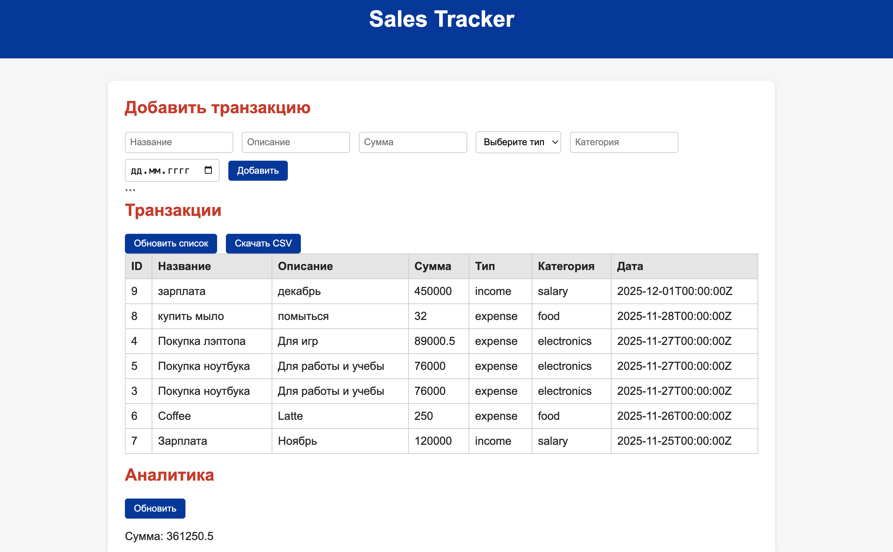

# Sales Tracker

## Sales Tracker — сервис учёта доходов и расходов с аналитикой, фильтрами, сортировкой и визуализацией данных.

Приложение позволяет создавать финансовые записи, редактировать, удалять их, просматривать статистику, строить графики и анализировать финансовую динамику по дням, неделям и месяцам.

## Возможности
### Работа с транзакциями
Создание записи (POST /items)
Обновление записи (PUT /items/:id)
Удаление записи (DELETE /items/:id)
Получение всех записей (GET /items)
Получение записи по ID (GET /items/:id)
Получение записей за период (GET /items/period)
Получение отсортированных записей (GET /items/sorted)

### Аналитика
Общая статистика:
  сумма
  среднее значение
  количество
  медиана
  90-й перцентиль
Группировка:
  по дням (GET /analytics/day)
  по неделям (GET /analytics/week)
  по месяцам (GET /analytics/month)
  по категориям (GET /analytics/category)

Финансовая динамика:
  доходы
  расходы

## Фронтенд (HTML + JS + Chart.js)

Фильтрация по дате
Выбор периода анализа (день, неделя, месяц)
распределение по категориям
динамика финансов
сравнение доходов и расходов
Красивый и лёгкий интерфейс без фреймворков